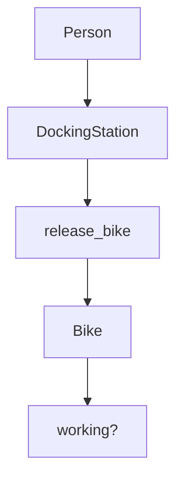
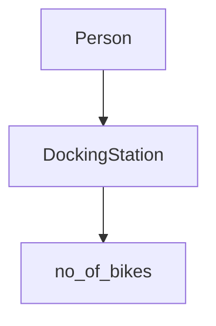
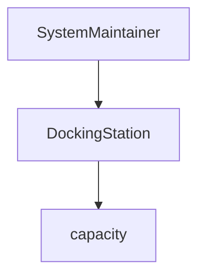
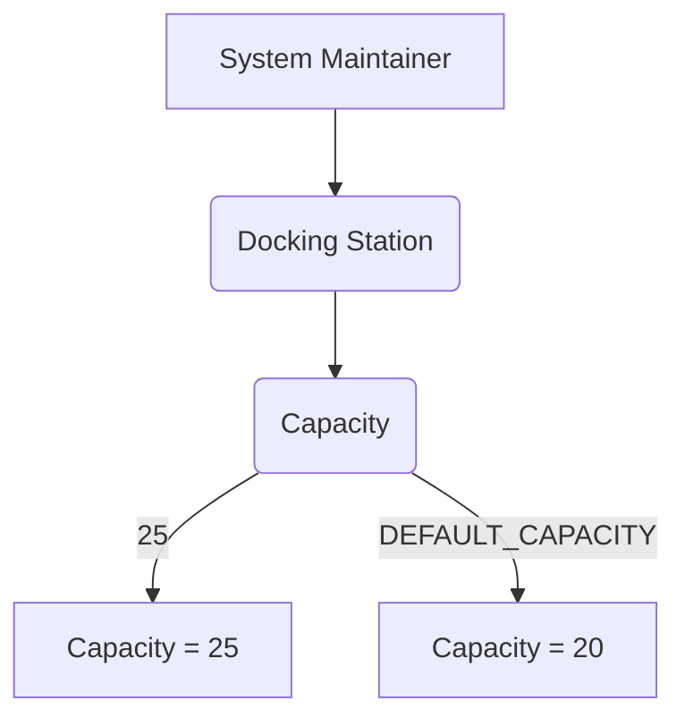
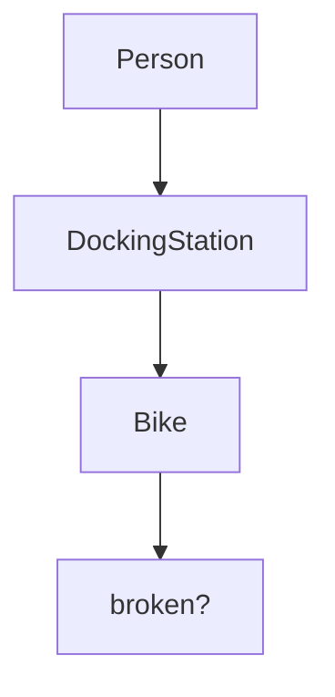
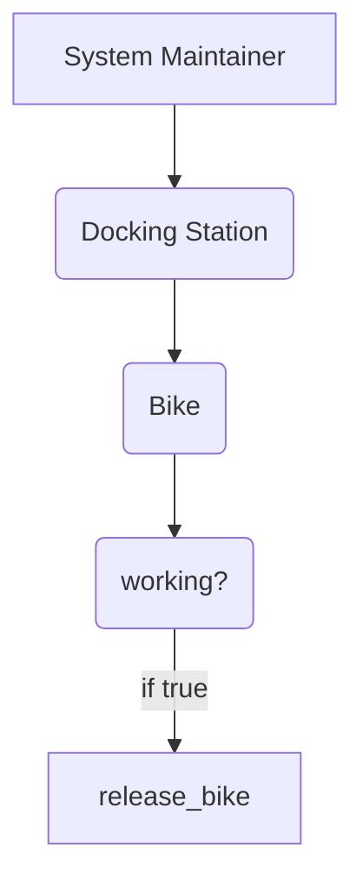

# Boris Bikes

Transport for London wish to create a new bike system, this program will emulate all the docking stations, bikes, and infrastructure.

## Getting started

`git clone path-to-your-repo`
`command_to_install_dependencies` (e.g. `bundle`)

## Usage

`command_to_start` (e.g. `rackup` or `rails s`)
Navigate to `http://localhost:4567/`

## Running tests

`test_command` (e.g. `rspec`)

### Domain Model and Diagram

## User Story

`As a User, So that I can use a bike, I'd like a docking station to release a bike.`

`As a User, So that I can use a good bike, I'd like to see if a bike is working`

|  Objects        |  Messages      |
| ----------      | -------------  | 
| Person          |                |
| Bike            | working?|
| DockingStation | release_bike   |

`As a member of the public 
So I can decide whether to use the docking station
I want to see a bike that has been docked`

|  Objects        |  Messages      |
| ----------      | -------------  | 
| Person          |                |
| Bike            | |
| DockingStation |  no_of_bikes  |

   
`As a system maintainer,
So that busy areas can be served more effectively,
I want to be able to specify a larger capacity when necessary.`

|  Objects        |  Messages      |
| ----------      | -------------  | 
| SystemMaintainer |                |
| DockingStation  |  capacity  |

|  Objects        |  Messages      |
| ----------      | -------------  | 
| SystemMaintainer |                |
| DockingStation  |  capacity  |

`As a member of the public,
So that I reduce the chance of getting a broken bike in future,
I'd like to report a bike as broken when I return it.`

|  Objects        |  Messages      |
| ----------      | -------------  | 
| Person |                |
| DockingStation  |   |
| Bike  |  broken? |

`As a maintainer of the system,
So that I can manage broken bikes and not disappoint users,
I'd like docking stations not to release broken bikes.`

|  Objects        |  Messages      |
| ----------      | -------------  | 
| System Maintainer |                |
| DockingStation  |  release_bike |
| Bike  |  broken? |

  